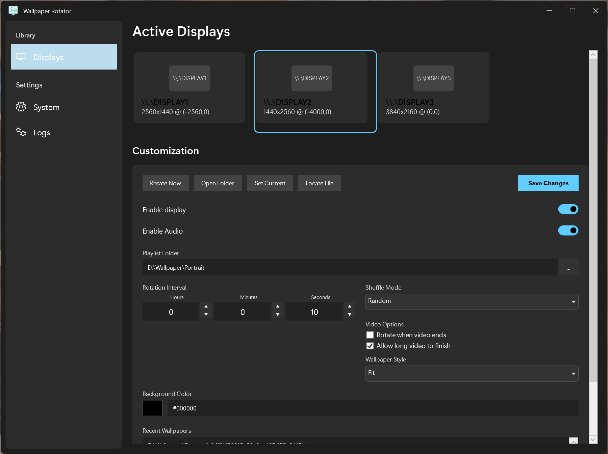
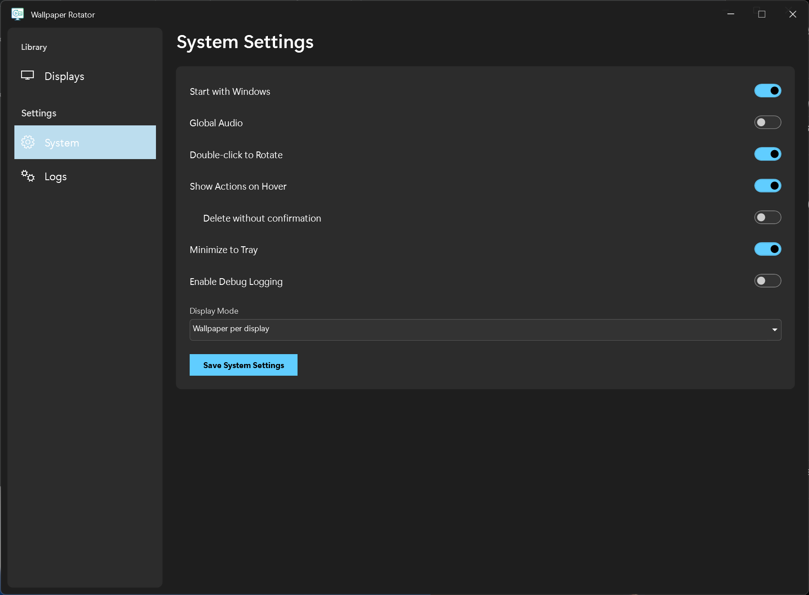

> **Note**: This project was created by Gemini 3 Pro, with the logo generated by Nano Banana Pro, in a 2-hour session. I have been using it personally and am satisfied with the results, so I decided to share it.

# Wallpaper Rotator

Multi-monitor wallpaper manager for Windows. Supports images and videos with per-monitor configuration and intuitive time-based rotation controls.

## Why This Project?

Existing wallpaper solutions often struggle with:
- **Frequent crashes** on Windows 11 24H2, especially with large wallpaper libraries
- **System instability** when locking/unlocking, changing display modes, or during fullscreen applications
- **Poor performance** with multi-monitor setups, taking minutes to launch and becoming unresponsive
- **Complexity** where simplicity is needed

Wallpaper Rotator was built to be **lightweight, stable, and crash-resistant** using a safe "No Injection" window strategy that avoids the issues plaguing other wallpaper applications on modern Windows versions.

## Screenshots

## Features

### Multi-Monitor Support
- Independent wallpapers and settings for each connected display
- Automatic monitor detection and configuration
- Per-monitor rotation intervals, styles, and audio control

### Media Support
- **Images**: JPG, PNG, BMP, WebP, GIF
- **Videos**: MP4, MKV, AVI, MOV, M4V, WEBM
- **Video Options**:
    - **Rotate on Video End**: Automatically rotate when video finishes
    - **Smart Looping**: Allow long videos to finish playing before rotating
    - **Strict Interval**: Enforce rotation interval even for videos

### Modern Interface
- **Windows 11 Aesthetic**: Mica material effects, rounded corners, dark theme
- **Intuitive Time Picker**: Set rotation intervals using hours/minutes/seconds selectors
- **Visual Monitor Cards**: Easy-to-understand overview of all displays
- **Toggle Switches**: Simple on/off controls for features
- **History & Navigation**: View recently displayed wallpapers and open them in Explorer
- **Shuffle Modes**:
    - **Random**: True random rotation
    - **By Name**: Alphabetical order
    - **By Date**: Chronological order (Newest First)

### Customization Options
- **Wallpaper Styles**: Fill, Fit, Stretch, Center, Cover
- **Background Colors**: Custom hex colors for non-filling content
- **Audio Control**: Global master switch and per-monitor audio toggle
- **Flexible Intervals**: Configure rotation timing from seconds to hours
- **Display Modes**:
    - **Per Display**: Independent wallpapers
    - **Stretch**: Span one wallpaper across all screens
    - **Clone**: Mirror the same wallpaper on all screens

### System Integration
- **System Tray**: Quick access to settings and manual rotation controls
- **Start with Windows**: Auto-launch on system startup
- **Low Resource Usage**: Efficient memory and CPU footprint
- **Taskbar Preservation**: Wallpapers respect taskbar area

## Installation

### Requirements
- Windows 10 (x64) or Windows 11
- .NET 7.0 Desktop Runtime (Required ONLY for Installer and Lite versions)

### Quick Start (Installer)
1. Download `WallpaperRotator-Setup-v1.0.0.exe` from the Releases page.
2. Run the installer and follow the setup wizard.
3. The application will start automatically in your system tray.

### Portable Versions
We offer two portable versions (single `.exe` file, no installation required):

1.  **WallpaperRotator-Portable.exe (~150MB)**:
    *   **Self-Contained**: Includes the entire .NET Runtime.
    *   **No Dependencies**: Does **NOT** require you to download or install .NET. It works out of the box.
    *   **Best for**: Users who want a plug-and-play experience on any PC.
    
2.  **WallpaperRotator-Lite.exe (~870KB)**:
    *   **Framework-Dependent**: Requires [.NET 7.0 Desktop Runtime](https://dotnet.microsoft.com/en-us/download/dotnet/7.0) to be installed.
    *   **Best for**: Users who already have .NET installed and want a tiny file size.

**To use:**
1.  Download the desired `.exe`.
2.  Place it in a folder of your choice (e.g., `C:\Tools\WallpaperRotator`).
3.  Run it! It will create a `config.json` in your AppData folder.
- **Manual Rotation**: Right-click tray icon → "Rotate All" or "Rotate [Monitor Name]"
- **Pause Rotation**: Disable individual monitors or turn off rotation entirely
- **Audio Control**: Toggle "Mute All" from tray menu or per-monitor in settings

### Tray Menu Quick Actions
- **Settings**: Open the main configuration window
- **Rotate All**: Immediately rotate wallpapers on all enabled monitors
- **Per-Monitor Rotation**: Quickly rotate specific displays
- **Mute All**: Toggle audio for all video wallpapers
- **Refresh Playlists**: Reload wallpaper folders
- **Exit**: Close the application

## Configuration Tips

### Optimal Performance
- Use native resolution wallpapers when possible
- Keep playlist folders organized with only wallpaper files
- Adjust rotation intervals based on your workflow (30-60 seconds recommended)

### Video Wallpapers
- The application uses Windows Media codecs
- Install [K-Lite Codec Pack](https://codecguide.com/download_kl.htm) for best format support
- Enable audio per-monitor for immersive experiences

### Multi-Monitor Setups
- Configure each monitor independently
- Use different playlists for different displays
- Adjust intervals based on monitor usage patterns

## Troubleshooting

For common issues and solutions, see [TROUBLESHOOTING.md](TROUBLESHOOTING.md).

## License

**MIT License**  
Copyright (c) 2025

Permission is hereby granted, free of charge, to any person obtaining a copy of this software and associated documentation files (the "Software"), to deal in the Software without restriction, including without limitation the rights to use, copy, modify, merge, publish, distribute, sublicense, and/or sell copies of the Software, and to permit persons to whom the Software is furnished to do so, subject to the following conditions:

The above copyright notice and this permission notice shall be included in all copies or substantial portions of the Software.

**THE SOFTWARE IS PROVIDED "AS IS", WITHOUT WARRANTY OF ANY KIND, EXPRESS OR IMPLIED, INCLUDING BUT NOT LIMITED TO THE WARRANTIES OF MERCHANTABILITY, FITNESS FOR A PARTICULAR PURPOSE AND NONINFRINGEMENT. IN NO EVENT SHALL THE AUTHORS OR COPYRIGHT HOLDERS BE LIABLE FOR ANY CLAIM, DAMAGES OR OTHER LIABILITY, WHETHER IN AN ACTION OF CONTRACT, TORT OR OTHERWISE, ARISING FROM, OUT OF OR IN CONNECTION WITH THE SOFTWARE OR THE USE OR OTHER DEALINGS IN THE SOFTWARE.**

---

> **Note**: This software was developed with AI assistance. While every effort has been made to ensure quality and stability, use at your own risk.
